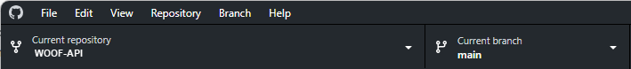

#### Back to [Home](index.md) | [Get started](index.md#get-started) | [Tutorials](index.md#tutorials) | [References](index.md#reference)


# Set up your environment
Before you can take the WOOF! API for a walk, you should set up your development environment.

This is a one-off setup that should take about 20 minutes to complete.

## Prerequisites
To use the WOOF! API you need:
* A [GitHub account](https://github.com/)
* A development system (PC, Mac, or Linux) running a current or long-term support (LTS version of the operating system).

## Install the required software components
Download and install the following software on your development system:
* [Git](https://docs.github.com/en/get-started/quickstart/set-up-git) (for the command line)
* [GitHub Desktop](https://desktop.github.com) (optional)
* A fork of the [WOOF! API repo](https://github.com/SophieLAPIDOC/WOOF)
* A current/LTS version of [node.js](https://nodejs.org/en)
* A current version of [json-server](https://www.npmjs.com/package/json-server)
* The [Postman desktop app](https://www.postman.com/downloads/). 

## Copy the WOOF! database
* Create a fork of the [WOOF! repository](https://github.com/SophieLAPIDOC/WOOF) in your GitHub account.

For detailed instructions, refer to [Fork a repository](https://docs.github.com/en/pull-requests/collaborating-with-pull-requests/working-with-forks/fork-a-repo) on GitHub Docs.

## Clone your WOOF! repo 
1. Log into your GitHub account and navigate to your forked WOOF! workspace.
2. Select **Code**, then **HTTPS** and copy the URL of your fork.
3. Open GitHub Desktop, then select **File > Clone repository ...** and paste the URL of your fork in the **URL** tab of the **Clone a repository** dialog.
4. Enter a **Local path**.
4. Select **Clone** to create a local copy of your fork.

For detailed instructions, refer to [Clone a repository](https://docs.github.com/en/repositories/creating-and-managing-repositories/cloning-a-repository) on GitHub Docs.

## Test the json-server
**Note:** This example assume your deveopement environement is Windows. On other development environement, you may want to use the `cmd` tool instead of GitBash. 

1. Open GitHub Desktop.
2. Ensure **Current repository** is set to cloned copy of WOOF!

    
3. From **Repository** (menu), select **Open Git Bash**.

    
3. In GitBash, check  it displays the file path to your cloned repository.
    
    
4. Run the following command to navigate to the API directory:

    ```
    cd api
    ```
2. Run this command to start the json-server.
    ```
    sh start-server.sh
    ```
    The json-server returns this message:
  
   ```
    Loading woof-db-source.json
    Done

    Resources
    http://localhost:3000/dog
    http://localhost:3000/park

    Home
     http://localhost:3000

    Type s + enter at any time to create a snapshot of the database
    Watching...
    ```
3. If your development system is installed correctly, you should see the service start and display the URL of the service: `http://localhost:3000`.

4. Make a test call to the server.
   ```
   curl http://localhost:3000/dog
   ```
   If the service is running correctly, you should see a list of dog from the service. For example:
   ```json
   [
    {
        "name": "Bella",
        "photo": "../Photos/Bella.jpeg",
        "breed": "mini pittie mix",
        "size": "Small",
        "human": "Wendy & Chris",
        "zip_code": "06417",
        "something_about_yourself": "I like dogs with good manners.",
        "at_the_park_?": "Y",
        "park_id": 3,
        "id": 1
    },
    {
        "name": "Mr. Henry Sullivan",
        "photo": "../Photos/HenrySullivan.jpeg",
        "breed": "Treeing Walker Coonhound",
        "size": "Large",
        "human": "Wendy & Chris",
        "zip_code": "06417",
        "something_about_yourself": "I love to play chase!",
        "at_the_park_?": "Y",
        "park_id": 3,
        "id": 2
    },
    ...
   ```
## Troubleshooting
If you don't see the list of dogs, or receive an error in any step of the procedure, investigate and correct the error before continuing. Some common situations that cause errors include:

* You mistyped a command.
* You aren't in the correct directory.
* A required software component did not install correctly.
* A required software component is not up to date.

Once you see a list of dogs, success! You are now ready for your [first tutorial](quick-start.md).
